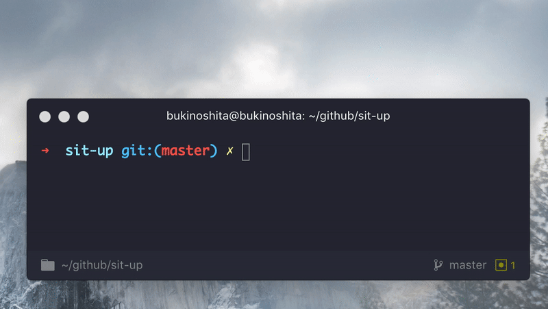

# sit-up [](https://travis-ci.org/bukinoshita/sit-up)

> Reminder to sit up straight

## Install

```bash
$ npm install -g sit-up
```

## Usage

```bash
$ sit-up --help

  Usage
    $ sit-up                  Remind to sit straight every 5 minutes
    $ sit-up <time>           Remind to sit straight every X minutes

  Examples
    $ sit-up (default: 5)
    $ sit-up 10

  Options
    -h, --help                Show help options
    -v, --version             Show version
```

## Demo



## License

MIT © [Bu Kinoshita](https://bukinoshita.io)
